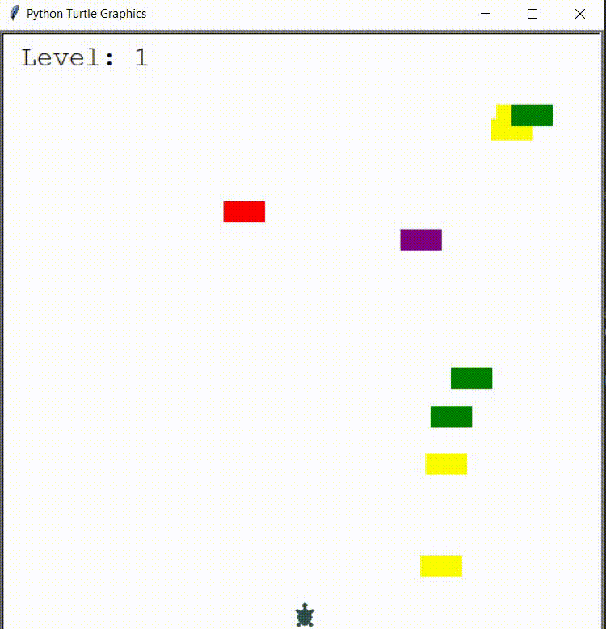

# Turtle Crossing Game
Here I recreated another Mini-Game in Python, following OOP and using the Turtle module.

## Game instructions
Use the arrow up key to move the turtle to the other side of the street without getting hit by a car.
Be careful as the cars will be moving faster, each time you level up!

